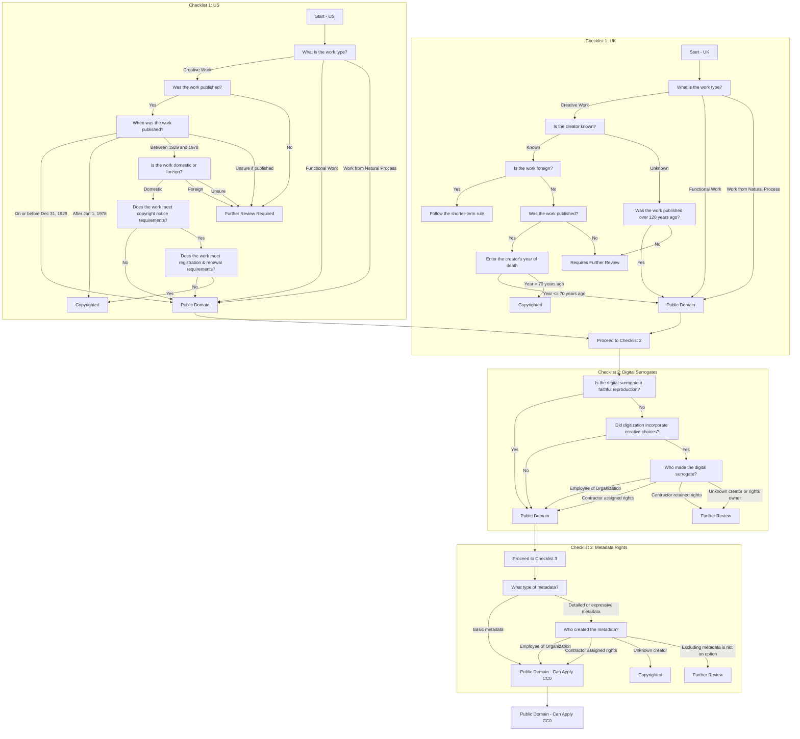

# GLAM-E Lab Copyright Clearance Flowchart

```mermaid
graph TD;

    %% UK Checklist 1
    subgraph Checklist 1: UK
        A_UK[Start - UK] --> B_UK[What is the work type?]
        B_UK -->|Creative Work| C_UK[Is the creator known?]
        B_UK -->|Functional Work| PD1_UK[Public Domain]
        B_UK -->|Work from Natural Process| PD1_UK

        C_UK -->|Known| D_UK[Is the work foreign?]
        C_UK -->|Unknown| E_UK[Was the work published over 120 years ago?]

        D_UK -->|Yes| F_UK[Follow the shorter-term rule]
        D_UK -->|No| G_UK[Was the work published?]

        E_UK -->|Yes| PD1_UK
        E_UK -->|No| HR1_UK[Requires Further Review]

        G_UK -->|Yes| H_UK[Enter the creator's year of death]
        G_UK -->|No| HR1_UK

        H_UK -->|Year <= 70 years ago| PD1_UK
        H_UK -->|Year > 70 years ago| CR1_UK[Copyrighted]

        %% Checklist 1 Results (UK)
        PD1_UK --> PD_C1[Proceed to Checklist 2]
    end

    %% US Checklist 1
    subgraph Checklist 1: US
        A_US[Start - US] --> B_US[What is the work type?]
        B_US -->|Creative Work| C_US[Was the work published?]
        B_US -->|Functional Work| PD1_US[Public Domain]
        B_US -->|Work from Natural Process| PD1_US

        C_US -->|Yes| D_US[When was the work published?]
        C_US -->|No| HR1_US[Further Review Required]

        D_US -->|"On or before Dec 31, 1929"| PD1_US
        D_US -->|"After Jan 1, 1978"| CR1_US[Copyrighted]
        D_US -->|"Between 1929 and 1978"| E_US[Is the work domestic or foreign?]
        D_US -->|"Unsure if published"| HR1_US

        E_US -->|Domestic| F_US[Does the work meet copyright notice requirements?]
        E_US -->|Foreign| HR1_US
        E_US -->|Unsure| HR1_US

        F_US -->|No| PD1_US
        F_US -->|Yes| G_US[Does the work meet registration & renewal requirements?]

        G_US -->|No| PD1_US
        G_US -->|Yes| CR1_US

        %% Checklist 1 Results (US)
        PD1_US --> PD_C1
    end

    %% Checklist 2: Digital Surrogates (Shared)
    subgraph Checklist 2: Digital Surrogates
        PD_C1 --> DS1[Is the digital surrogate a faithful reproduction?]
        DS1 -->|Yes| PD2[Public Domain]
        DS1 -->|No| DS2[Did digitization incorporate creative choices?]
        DS2 -->|No| PD2
        DS2 -->|Yes| DS3[Who made the digital surrogate?]
        DS3 -->|Employee of Organization| PD2
        DS3 -->|Contractor assigned rights| PD2
        DS3 -->|Contractor retained rights| HR2[Further Review]
        DS3 -->|Unknown creator or rights owner| HR2
    end

    %% Checklist 2 Results
    PD2 --> PD_C2[Proceed to Checklist 3]

    %% Checklist 3: Metadata Rights (Shared)
    subgraph Checklist 3: Metadata Rights
        PD_C2 --> M1[What type of metadata?]
        M1 -->|Basic metadata| PD3[Public Domain - Can Apply CC0]
        M1 -->|Detailed or expressive metadata| M2[Who created the metadata?]
        M2 -->|Employee of Organization| PD3
        M2 -->|Contractor assigned rights| PD3
        M2 -->|Unknown creator| CR3[Copyrighted]
        M2 -->|Excluding metadata is not an option| HR3[Further Review]
    end

    %% Checklist 3 Results
    PD3 --> PD_Final[Public Domain - Can Apply CC0]
```
