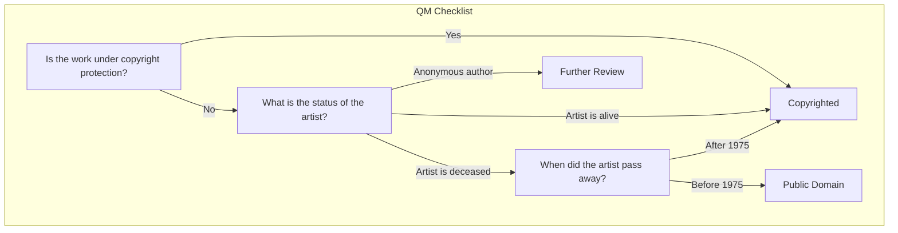

# QM Copyright Clearance Flowchart

```mermaid

graph TD;
    subgraph QM Checklist
        QA[Is the work under copyright protection?] -->|Yes| CR5[Copyrighted]
        QA -->|No| QB[What is the status of the artist?]

        QB -->|Artist is alive| CR5[Copyrighted]
        QB -->|Artist is deceased| QC[When did the artist pass away?]
        QB -->|Anonymous author| HR6[Further Review]

        QC -->|Before 1975| PD11[Public Domain]
        QC -->|After 1975| CR5[Copyrighted]
    end
```
